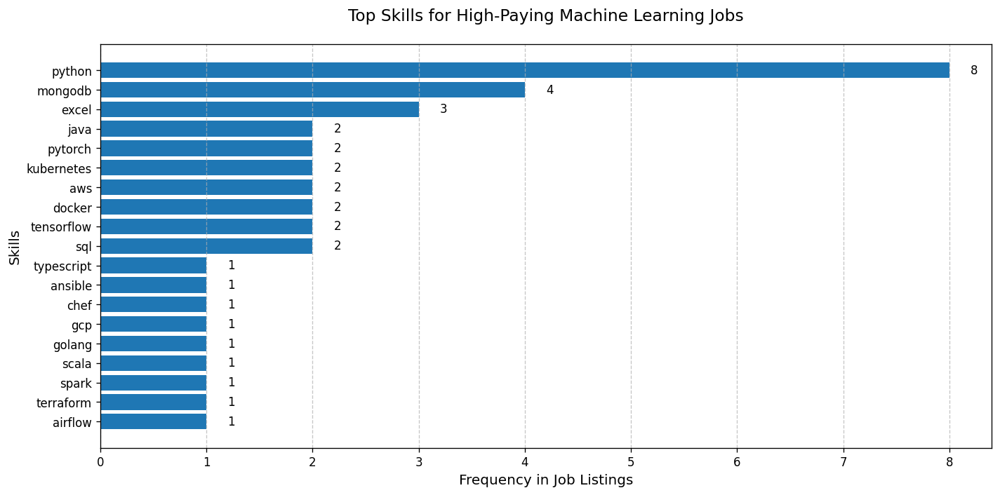

# Introduction
📊 Dive into the data job market! Focusing on machine learning roles, this project explores 💰 top-paying jobs, 🔥 in-demand skills, and 📈 where high demand meets high salary in machine learning engineery.

🔍 SQL queries? Check them out here: [project_sql folder](/project_sql/)

# Background
Driven by a quest to navigate the machine learning job market more effectively, this project was born from a desire to pinpoint top-paid and in-demand skills, streamlining others work to find optimal jobs.

Data hails from [SQL Course](https://lukebarousse.com/sql). It's packed with insights on job titles, salaries, locations, and essential skills.

### The questions I wanted to answer through my SQL queries were:

1. What are the top-paying machine learning jobs?
2. What skills are required for these top-paying jobs?
3. What skills are most in demand for machine learning engineers?
4. Which skills are associated with higher salaries?
5. What are the most optimal skills to learn?

# Tools I Used
For my deep dive into the machine learning job market, I harnessed the power of several key tools:

- **SQL:** The backbone of my analysis, allowing me to query the database and unearth critical insights.
- **PostgreSQL:** The chosen database management system, ideal for handling the job posting data.
- **Visual Studio Code:** My go-to for database management and executing SQL queries.
- **Git & GitHub:** Essential for version control and sharing my SQL scripts and analysis, ensuring collaboration and project tracking.

# The Analysis
Each query for this project aimed at investigating specific aspects of the machine learning job market. Here’s how I approached each question:

### 1. Top Paying Data Analyst Jobs
To identify the highest-paying roles, I filtered machine learning positions by average yearly salary and location, focusing on remote jobs. This query highlights the high paying opportunities in the field.

```sql
SELECT
    job_id,
    job_title,
    job_location,
    job_schedule_type,
    salary_year_avg,
    job_posted_date,
    name AS company_name
FROM
    job_postings_fact
LEFT JOIN company_dim ON job_postings_fact.company_id = company_dim.company_id
WHERE
    job_title_short = 'Machine Learning Engineer'
    AND job_location = 'Anywhere'
    AND salary_year_avg IS NOT NULL
ORDER BY
    salary_year_avg DESC
LIMIT 10;
```
Here's the breakdown of the top machine learning jobs in 2023:
- **Wide Salary Range:** Top 10 paying machine learning roles span from $200,000 to $325,000, indicating significant salary potential in the field.
- **Diverse Employers:** Companies like Acceler8 Talent, MongoDB, and Storm5 are among those offering high salaries, showing a broad interest across different industries.
- **Job Title Variety:** There's a high diversity in job titles, from Machine Learning Engineer to Director of Engineering, reflecting varied roles and specializations within machine learning engineery.


*Bar graph visualizing the salary for the top 10 salaries for data analysts*

### 2. Skills for Top Paying Jobs
To understand what skills are required for the top-paying jobs, I joined the job postings with the skills data, providing insights into what employers value for high-compensation roles.
```sql
WITH top_paying_jobs AS (    
    SELECT
        job_id,
        job_title,
        salary_year_avg,
        name AS company_name
    FROM
        job_postings_fact
    LEFT JOIN company_dim ON job_postings_fact.company_id = company_dim.company_id
    WHERE
        job_title_short = 'Machine Learning Engineer'
        AND job_location = 'Anywhere'
        AND salary_year_avg IS NOT NULL
    ORDER BY
        salary_year_avg DESC
    LIMIT 10
)

SELECT 
    top_paying_jobs.*,
    skills_dim.skills
FROM
    top_paying_jobs
INNER JOIN skills_job_dim ON top_paying_jobs.job_id = skills_job_dim.job_id
INNER JOIN skills_dim ON skills_job_dim.skill_id = skills_dim.skill_id
ORDER BY
    top_paying_jobs.salary_year_avg DESC;
```
Here's the breakdown of the most demanded skills for the top 10 highest paying machine learning jobs in 2023:
- **Python** is leading with a bold count of 8.
- **MogoDB** follows with a count of 4.
- **Excel** is also highly sought after, with a bold count of 3.
Other skills like **pytorch**, **tensorflow**, **sql**, and **java** show varying degrees of demand.


*Bar graph visualizing the count of skills for the top 10 paying jobs for machine learning engineers*

### 3. In-Demand Skills for Machine Learning Engineers

This query helped identify the skills most frequently requested in job postings, directing focus to areas with high demand.

```sql
SELECT
    skills,
    COUNT(skills_job_dim.job_id) AS demand_count
FROM
    job_postings_fact
INNER JOIN skills_job_dim ON job_postings_fact.job_id = skills_job_dim.job_id
INNER JOIN skills_dim ON skills_job_dim.skill_id = skills_dim.skill_id
WHERE
    job_postings_fact.job_title_short = 'Machine Learning Engineer'
GROUP BY
    skills
ORDER BY
    demand_count DESC
LIMIT 5;
```
Here's the breakdown of the most demanded skills for machine learning engineers in 2023
- **Python** remains fundamental, emphasizing the need for strong foundational skills in programming.
- Frameworks like **Pytorch** and **Tensorflow** are essential, pointing towards the importance of skills in the field of **Deep Learning**.
- **AWS** is the clear cloud leader and **SQL** is important for working with databases.

| Skills      | Demand Count |
|-------------|--------------|
| python      | 9685         |
| pytorch     | 4389         |
| tensorflow  | 4307         |
| aws         | 3780         |
| sql         | 3497         |

*Table of the demand for the top 5 skills in data analyst job postings*

### 4. Skills Based on Salary
Exploring the average salaries associated with different skills revealed which skills are the highest paying.
```sql
SELECT
    skills,
    ROUND(AVG(salary_year_avg), 2) AS average_salary
FROM
    job_postings_fact
INNER JOIN skills_job_dim ON job_postings_fact.job_id = skills_job_dim.job_id
INNER JOIN skills_dim ON skills_job_dim.skill_id = skills_dim.skill_id
WHERE
    job_postings_fact.job_title_short = 'Machine Learning Engineer'
    AND job_work_from_home = TRUE
    AND salary_year_avg IS NOT NULL
GROUP BY
    skills
ORDER BY
    average_salary DESC
LIMIT 25;
```
Here's a breakdown of the results for top paying skills for Data Analysts:
### 1. DevOps Dominates Top Salaries
- **Chef & Ansible** (both $325K) command the highest salaries
- Shows premium value of **ML infrastructure automation** skills
- Rare but extremely valuable when combined with ML expertise

### 2. Specialized Programming Pays Off
- **Golang** ($300K) and **Scala** ($252K) outperform Python
- Reflects demand for:
  - High-performance systems (Golang)
  - Big Data processing (Scala/Spark)

### 3. Surprise High-Earners
- **Excel** ($283K) ranks surprisingly high, indicating senior roles value:
  - Business communication
  - Data analysis/storytelling
- **MongoDB** ($235K) appears in niche platform leadership roles

### 4. Production ML > Pure Modeling
- **Docker** ($194K) and **Kubernetes** ($174K) outearn many ML frameworks
- Market premium for:
  - Deployment skills
  - Scalable ML systems
  - Cloud-native machine learning

## Salary Hierarchy
1. **Infrastructure-as-Code** ($325K)
2. **Specialized Languages** ($250-300K)
3. **Databases/ETL** ($200-235K)
4. **Containerization** ($170-194K)

## Key Takeaway
Highest ML salaries go to professionals who combine:
- Traditional machine learning knowledge
- Infrastructure automation (DevOps)
- Specialized system building (Golang/Scala)

| Skills        | Average Salary ($) |
|---------------|-------------------:|
| chef          |          325000.00 |
| ansible       |          325000.00 |
| golang        |          300000.00 |
| excel         |          283333.33 |
| scala         |          252500.00 |
| mongodb       |          235500.00 |
| docker        |          194331.14 |
| c#            |          180000.00 |
| kubernetes    |          174102.25 |
| airflow       |          174063.60 |

*Table of the average salary for the top 10 paying skills for data analysts*

### 5. Most Optimal Skills to Learn

Combining insights from demand and salary data, this query aimed to pinpoint skills that are both in high demand and have high salaries, offering a strategic focus for skill development.

```sql
SELECT
    skills_dim.skill_id,
    skills_dim.skills,
    COUNT(job_postings_fact.job_id) AS demand_count,
    ROUND(AVG(job_postings_fact.salary_year_avg), 2) AS avg_salary
FROM
    job_postings_fact
JOIN skills_job_dim ON job_postings_fact.job_id = skills_job_dim.job_id
JOIN skills_dim ON skills_job_dim.skill_id = skills_dim.skill_id
WHERE
    job_postings_fact.job_title_short = 'Machine Learning Engineer'
    AND job_postings_fact.job_work_from_home = TRUE
    AND job_postings_fact.salary_year_avg IS NOT NULL
GROUP BY
    skills_dim.skill_id
ORDER BY
    demand_count DESC,
    avg_salary DESC
LIMIT 10;
```

## Top Machine Learning Skills: Demand vs. Salary

| Skill ID | Skill      | Demand Count | Avg Salary ($) |
|----------|------------|--------------|----------------:|
| 1        | Python     | 33           | 150,570.24     |
| 76       | AWS        | 12           | 168,401.50     |
| 0        | SQL        | 11           | 152,983.45     |
| 101      | PyTorch    | 11           | 122,892.55     |
| 99       | TensorFlow | 10           | 132,031.80     |
| 213      | Kubernetes | 8            | 174,102.25     |
| 214      | Docker     | 7            | 194,331.14     |
| 4        | Java       | 7            | 171,428.57     |
| 81       | GCP        | 7            | 163,974.00     |
| 92       | Spark      | 6            | 168,386.33     |

*Table of the most optimal skills for machine learning engineer sorted by salary*

Here's a breakdown of the most optimal skills for Machine Learning Engineers in 2023: 
###  Highest-Paying Skills (Despite Lower Demand)
- **Docker ($194K)** & **Kubernetes ($174K)** offer **~30% higher salaries than Python**
- *Why?* Critical for deploying ML models at scale (DevOps/MLOps crossover)

###  Cloud > Frameworks
- **AWS ($168K)** and **GCP ($164K)** pay **12-20% more** than TensorFlow/PyTorch
- *Implication*: Cloud deployment skills outweigh pure ML framework knowledge

###  Big Data = Big Money
- **Spark ($168K)** matches cloud salaries, showing strong demand for distributed ML processing

###  The Python Paradox
- **Highest demand (33 jobs)** but **lowest pay ($151K)** among core skills
- *Solution*: Combine Python with Docker/AWS for maximum earning potential

###  Surprise Outperformers
- **Java ($171K)** pays more than Python despite similar demand
- **SQL ($153K)** remains essential for data pipelines and analytics

# What I Learned

Throughout this adventure, I've turbocharged my SQL toolkit with some serious firepower:

- **🧩 Complex Query Crafting:** Mastered the art of advanced SQL, merging tables like a pro and wielding WITH clauses for ninja-level temp table maneuvers.
- **📊 Data Aggregation:** Got cozy with GROUP BY and turned aggregate functions like COUNT() and AVG() into my data-summarizing sidekicks.
- **💡 Analytical Wizardry:** Leveled up my real-world puzzle-solving skills, turning questions into actionable, insightful SQL queries.

# Conclusions

### Insights
# Machine Learning Engineer Skills Analysis

## Key Insights

### 1. Top-Paying Machine Learning Engineer Jobs
The highest-paying ML engineering roles offer salaries up to $325,000, with Principal and Senior ML Engineer positions leading the market. Remote opportunities are increasingly common, making these roles accessible globally.

### 2. Most Valuable Skills for High Salaries
- **DevOps & Infrastructure Automation** (Chef, Ansible, Docker, Kubernetes) command the highest salaries (~$325K), highlighting the demand for MLOps expertise.
- **Cloud Platforms** (AWS, GCP) and **Big Data Tools** (Spark, Scala) also offer significant salary premiums (~$165K-$250K).
- **Python**, while the most in-demand skill, has a lower average salary ($150K), emphasizing the need to pair it with specialized skills (e.g., cloud, containers, or big data).

### 3. Most In-Demand Skills
- **Python** dominates job postings (33 listings), followed by **SQL** (11) and **AWS** (12).
- **TensorFlow & PyTorch** remain essential for ML modeling but pay less than deployment-focused skills.

### 4. Skills with Salary Premiums
- **Docker** ($194K) and **Kubernetes** ($174K) offer ~30% higher pay than Python, proving that production-grade ML skills are highly rewarded.
- **Java** ($171K) and **GCP** ($164K) outperform generalist skills, reinforcing the value of specialization.

### 5. Surprising Trends
- **Excel** ($283K) appears in high-paying roles, suggesting senior positions value data communication.
- **MongoDB** ($235K) is niche but lucrative for ML platform leadership roles.

## Closing Thoughts
This analysis reveals that machine learning engineers maximize earnings by combining core ML skills (Python, TensorFlow) with infrastructure (Docker, Kubernetes) and cloud expertise (AWS, GCP). While Python remains essential, specializing in deployment, automation, or big data significantly boosts salary potential.